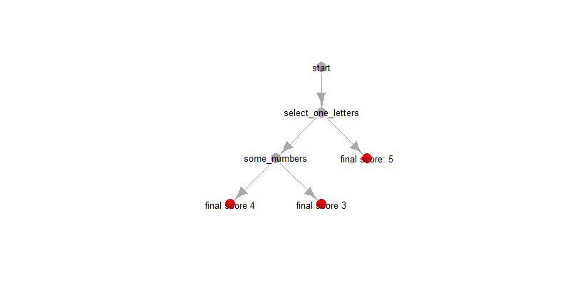

```{r setup, include = FALSE}
knitr::opts_chunk$set(
  collapse = TRUE,
  comment = "#>",echo = TRUE
    
)

```

```{r, include=F}
library(composr)
library(dplyr)
df<-data.frame(select_one_letters=sample(letters,500,T),
               some_numbers=runif(500)*20,
               id=1:500,
               select_multiple_letters = sapply(1:500,function(x){
                 sample(LETTERS,round(runif(1,min = 1,max = 10)),T) %>% paste(collapse=" ")
                 }))
df<-lapply(df,function(x){x[sample(1:length(x), 100)]<-NA; x}) %>% as_tibble
```


# Preparation

## example data

For illustration we'll use this simple test data frame:

```{r,eval=F}
df

```

```{r,echo=F}
knitr::kable(head(df))

```

## Loading the package

load the package with

```{r,eval = FALSE}
library(composr)
```

In this tutorial, we will also use the `dplyr` package, because it plays nicely with `composr`:

```{r,eval=FALSE}
library(dplyr)
```

# Recoding: the Basics


## Starting a new recoding

First, you start a recoding, and name the source and the target variable (the source variable must exist in the dataset, and the target variable must _not_ yet exist in the data set).

```{r}

df %>%
  new_recoding(source = some_numbers,
               target = number_size) 


```

This already creates the new variable; the new variable is filled with all NAs by default. Recoding then happens through consecutive conditions. For each condition, you supply a value to be used if the condition is fulfilled. Rows for which no condition is fullfilled default to `NA`.

## Adding a chain of recoding conditions


A simple example with numbers. We start a new recoding, specifying the source and target variables. Then we apply a condition that recodes all numbers larger than 10 to "big number":


```{r}

df %>%
  
  new_recoding(source = some_numbers,
               target = number_size) %>% 
  
  recode_to("big number", where.num.larger = 10)


```

Again, everything that does not fulfill the condition remains NA, but everything that was >10 in the source variable ("some_numbers") is now set to "big number" in the target variable. The source variable remains unchanged (always!). Let's add a second condition:


```{r}

df %>%
  
  new_recoding(source = some_numbers,
               target = number_size) %>% 
  
  recode_to("big number",
            where.num.larger = 10) %>% 
  
  
  recode_to("small number",
            where.num.smaller.equal = 10)


```

Tadaaa!

## Ending a recoding

Once we're done, we add `end_recoding()` to the chain. This gives us back the complete original data, with the newly recoded variable added in the end:

```{r}

df %>%
  
  new_recoding(source = some_numbers,
               target = "number_size") %>% 
  
  recode_to("big number",
            where.num.larger = 10) %>% 
  
  
  recode_to("small number",
            where.num.smaller.equal = 10) %>% 
  
  end_recoding()


```


## The Order Mattres! 

What is important to remember is that the _order_ of the conditions is important; if more than one condition applies, the last one counts:

```{r}

df %>%
  
  new_recoding(target = number_size, source = some_numbers) %>% 
  
  recode_to("gigantic",where.num.larger.equal = 15) %>% 
  recode_to("large", where.num.smaller = 15) %>% 
  recode_to("medium", where.num.smaller = 10) %>% 
  recode_to("small", where.num.smaller = 5) %>% 
  recode_to("tiny", where.num.smaller = 2) %>% 
  
  end_recoding()


```
Here, first _all_ numbers smaller than 15 are set to "large" - including very small numbers. However for smaller numbers, that condition is then overwritten.

 
## Different types of conditions


For simple numbers this seems a bit tedious; however there are quite a few "where..." conditions for numbers ("where.num...") and for categorical select_one or select_multiple ("where.selected") questions that come in handy:

- **for categorical source variables:**
    - `where.selected.any` supply a single value or a vector. If a response contains _any_ of the supplied values, the condition applies. 
    - `where.selected.all` supply a single value or a vector. If a response contains _all_ of the supplied values, the condition applies.
    - `where.selected.exactly` supply a single value or a vector. If a response contains _exactly_ all of the supplied values and no other values, the condition applies.
    - `where.selected.none` supply a single value or a vector. If a response contains _none_ of the supplied values, the condition applies.
- **for numerical source variables:**
    - `where.num.equal` the condition applies if the number is ... exactly the supplied value
    - `where.num.smaller` ...smaller than the supplied value
    - `where.num.smaller.equal` ... smaller or equal to the supplied value
    - `where.num.larger` ... larger 
    - `where.num.larger.equal`... larger or equal


Here an example with a categorical variable with multiple responses (this package assumes that responses are separated with a single space " "):
```{r}

df %>% 
  
  new_recoding(target = letter_combos,
               source = select_multiple_letters) %>% 
  
  recode_to("at least one of A, B and C",
            where.selected.any = c("A","B","C")) %>% 
  
  recode_to("all of A, B and C",
            where.selected.all = c("A","B","C")) %>% 
  
  recode_to("none from A, B or C selected",
            where.selected.none = c("A","B","C")) %>% 
  
  recode_to("exactly A, B and C (and nothing else) selected",
            where.selected.exactly = c("A","B")) %>% 
  
  end_recoding()

```


## Changing the Source Variable

It is also possible to change the source variable during recoding. The target variable stays the same:

```{r}

df %>% new_recoding(target = cross_var_recoding,
                    source = select_multiple_letters
                    ) %>%

  recode_to(to = "select one of the first 15 letters in the alphabet",
          where.selected.any = LETTERS[1:15]) %>%

  recode_to(to = "ignore the selected letters! this record has num > 15!",
          where.num.larger = 15,
          source = some_numbers) %>% 
  
  end_recoding()

```

As above, any rows that match more than one condition will be set to the "to" parameter value, essentially ignoring any previous matches. The conditions are **not** 'added' like an "AND" operator (which would mean "set the value where _both_ conditions are fulfilled"). Instead, it always means "set the value of the _last_ condition that applies, independent from the previous conditions" 


## Special cases: "otherwise"", "skipped" and `NA`

In addition to a condition parameter ("where..."), extra values can be supplied for various cases where the condition is not fulfilled:

- `na.to = `: NAs in the source variable are set to the value supplied to this parameter
- `skipped.to = `: values that are `NA` in the source variable because the question was skipped in the kobo questionnaire are set to the value supplied to this parameter
- `otherwise.to = `: values that are not NA in the source variable and do not fulfill the condition are set to the value supplied to this parameter

### 'otherwise.to' and 'na.to' example

we can for example use `otherwise.to` to shortcut the example above, and add a special value for `NA`s using `na.to`:


```{r}
df %>%
  
  new_recoding(target = "number_size",
               source = some_numbers
               ) %>% 
  
  recode_to("big number",
            where.num.larger = 10,
            otherwise.to = "small number",
            na.to = "COULD BE ANYTHING!") %>% 
  
  end_recoding()


```

using `na.to` always throws a warning. It is assumed that`NA` is real missing data, so recoding that into some values may be a flaw in the methodology.


### `skipped.to`: Recoding Skiplogic with koboquest


In order to use `skipped.to` (recoding values that were skipped in the questionnaire), you need to be familiar with the `koboquest` package.
Then you can use it to load the questionnaire, and pass it to `recode_to`.

Here is an example, for which we create a fake kobo questionaire. In the fake questionnaire, we defined that  all `select_one_letters` are skipped wherever `some_numbers` is larger than three. Here's our tiny example questionnaire:


```{r,include = F}
# creating a "fake" kobo questionnaire:
select_one_lower_letters_relevant <- 
  "( ${some_numbers} < 3 )"

questions<-data.frame(name = c("select_one_letters", "some_numbers", "select_multiple_letters"),
                      type = c("select_one lower_letters","integer","select_multiple upper_letters"),
                      relevant=c(select_one_lower_letters_relevant,"",""),stringsAsFactors = F)


choices<-data.frame("list_name" = rep("lower_letters",length(letters)),
                    name=letters, label = paste("letter:",letters))
```

```{r,eval=F}
questions
```


```{r,echo=F}
knitr::kable(questions)
```

```{r,eval=F}
choices
```


```{r,echo=F}
knitr::kable(head(choices))
```


We can load the questinonaire `koboquest` style:

```{r,warning=F,message=F}
my_questionnaire <- koboquest::load_questionnaire(data = df,
                              questions = questions,
                              choices = choices)

```

Then we pass it to the `recode_to` function and use it to recode skipped values to a special value:

```{r}


df %>% new_recoding(target = new_variable,
                    source = select_one_letters) %>%
  
  recode_to("first half of alphabet",
            where.selected.any = letters[1:13],
            otherwise.to = "second half of alphabet",
            skipped.to = "this one was skipped",
            questionnaire = my_questionnaire)


```


## Recoding complex conditions across source variables: generic "where" condition

Apart from the quite strict (but hopefully easy to use) `recode_to()`, there is the generic "where" argument; here you need to specify an expression that evaluates to a logical (TRUE/FALSE) condition.
Here you _only_ supply the input data, the "to" value you want to recode to and a generic `where` condition. The "where" condition can be any R code that can run inside the namespace of the input data; this means you can use data column names directly. (hopefully clear to tidyverselers, and to everyone else with the example below):

### example 
Let's say we want a recoding condition that says "turn all values where `select_one_letters` is in the first 12 letters of the alphabet, **AND** `some_numbers` < 15". We can specify that conditon in the simple "where" parameter as straight up R code:
```{r}

df %>% new_recoding(target = free_recoded_index) %>% recode_to(to="A-G and smaller than fifteen",
            where = (select_one_letters %in% letters[1:7]) & some_numbers < 15) %>% end_recoding()

```


### Extra functions for free recoding

#### Skip logic

If you pass the questionnaire, you can use `is_skipped()` inside the where condition:

```{r}
df %>%
  
  new_recoding(target = "new values for skipped") %>% 
  recode_to("SKIPPED!",
            where = is_skipped(select_one_letters) & !is.na(some_numbers),
            questionnaire = my_questionnaire) %>% 
  
  end_recoding()


```

### Select multiple questions

responses to select multiple questions are stored as strings, with the different responses separated by a space; for example if someone selected "A", "B" and "C", the data will be "A B C". Therefore you can not simply say do `select_multiple_letters %in% c("A","B","C")` - this would never match. If you instead do `select_multiple_letters == "A B C"`, it would only match that exact combination in that exact order. So select multiple question are a bit more complicated.
For this, we have an additional "helper" function that you can use inside the where condition: `sm_selected()` (short for "select_multiple" selected):

Examples:
```{r}
a_select_multiple_vector<-c("A",
                            "A B",
                            "A B C ",
                            "A B C D E",
                            "X Y Z")


# were any from A, B or C selected?
sm_selected(a_select_multiple_vector,
            any = c("A","B","C"))

# were all from A, B or C selected?
sm_selected(a_select_multiple_vector,
            all = c("A","B","C"))

# were exactly  A, B and C selected?
sm_selected(a_select_multiple_vector,
            exactly  = c("A","B","C"))


# were none of A, B and C selected?
sm_selected(a_select_multiple_vector,
            exactly  = c("A","B","C"))

```


Using this in `recode_to()` with `where = `:
```{r}
df %>% new_recoding(has_any_ABC_and_num_smaller_ten) %>% 
  recode_to("yes",
            where = sm_selected(select_multiple_letters, any = c("A", "B", "C")) & some_numbers < 10
            )
                    
```


```{r}
df %>% new_recoding(target = severity) %>% 
  recode_to(5,
            where = sm_selected(select_multiple_letters, any = c("A","B","C"))) %>% 
  end_recoding

```


## "direct recoding"


### Example

instead of individual recodings with a where condition, you can use an expression that produces the "to" value directly with `recode_directly()`:


```{r}

df %>% new_recoding("somenumbers_decimals") %>% recode_directly(some_numbers - floor(some_numbers))


```

### direct_recoding never mixes up rows!

This runs on _each row individually_. The essential difference to for example dplyr's `transform` and `mutate` is that `recode_directly` operates on each row completely independently. See the difference for example here: 
```{r}
# create a second random numeric variable for demonstration
df$some_numbers2<-runif(nrow(df))
df %>% transmute(max_num = max(some_numbers,some_numbers2,na.rm = T))
```
`transmute` took the maximum value between `some_numbers` and `some_numbers2` and gave back the maximum value _overall_.
In contrast, `recode_directly` gets the larger value per record:
```{r}

df %>% new_recoding(max_num) %>% 
  recode_directly(max(some_numbers,some_numbers2,na.rm = T))

```

### direct recoding supports `sm_selected` and `is_skipped` 

... like the title says. Generally here you can go rouge:

```{r}

df %>% new_recoding(test) %>% 
  
  recode_directly(

      if( sm_selected(select_multiple_letters, any=letters[1:10]) & !is_skipped(select_one_letters)){
        "yes"
        }
      else{
          "no"
        }
    
    ,questionnaire = my_questionnaire)


```


# Batch Recoding

if you need to do a lot of recoding & composing, you may end up with a lot of code.
To cut things down a bit and keep an easier overview, you can use `recode_batch()` to apply a vector of generic where conditions.

We start with a data.frame (for example from a csv file) with multiple `to` values, `target` variables and `where` conditions. The recode_batch function actually takes individual vectors for each argument, but they're easier to store in one data.frame


```{r,include=F}

many_recodings <- data.frame(to_values = c(1,2,3),
                             target_variables = c("new_var1","new_var1","new_var2"),
                             conditions = c('sm_selected(select_multiple_letters,any=c("A","B","C","D"))',
                                            'some_numbers < 10',
                                            'select_one_letters %in% letters[1:10]'),
                             stringsAsFactors = F)

```

```{r,eval=F}
many_recodings
```
```{r,eval=T,results='asis',echo=F}
knitr::kable(many_recodings)
```

Now we can apply them all 'at once' (they are still run in sequence). Note that each argument is given a vector (extracted from the data frame):

```{r}
library(composr)
df %>% recode_batch(tos = many_recodings$to_values,
                    wheres = many_recodings$conditions,
                    targets = many_recodings$target_variables) %>% 
  end_recoding()

```
This created two variables, in line with the two different target variables specified. The first two conditions are used to recode to the first two `to` values on the target variable specified in the first two elements of the `targets`.


# Making weighted Sums


This whole thing works for making weighted sums. For this we will recode variables to numeric, and then use `dplyr::mutate()` to sum them up (no worries, there is almost nothing new compared to abve!) Let' say we need a weighted sum between  `select_one_letters` and `select_mutiple_letters`.

- In the `select_one_letters`:
    - the first 10 letters weight `1`
    - the others weight `2`

- in `select_multipe_letters`
    - having ticked nothing weighs 0
    - selecting any weights `1`
    - selecting at least some from the fist 10 letters is a `2`
    - but when "A"" was ticked, it weighs 3 regardless of the other choices. 

Here's how we do it:

```{r}

df %>%
  # first recoding to weights
  new_recoding(source = select_one_letters,
               target = select_one_weights) %>% 
  
  recode_to(1,
            where.selected.any = letters[1:10],
            otherwise.to = 2) %>%
  # end the first recoding
  end_recoding() %>% 

  # second recoding to weights
  new_recoding(select_multiple_weights,
               select_multiple_letters
               ) %>%  
  
  recode_to(0,where.selected.none = LETTERS) %>% 
  
  recode_to(1,where.selected.any = LETTERS) %>% 
  
  recode_to(2,where.selected.any = LETTERS[1:10]) %>% 
  
  recode_to(3, where.selected.any = "A") %>%  
  
  # end the second recoding
  end_recoding() %>% 
  
  # sum the two together!
  mutate(total_score = select_one_weights + select_multiple_weights)


```
You see here also that we can also create two variables by piping directly from a `end_recoding()` into a `new_recoding`. 


# Making a Decision Tree

Alternatively, you can use this to form "decision tree" style severity scores. Here is an example:
```{r, echo = F}
# 
# edges<-matrix(c(
#             "start",
#             "select_one_letters",
#             "",
#   
#             "select_one_letters",
#             "some_numbers",
#             "A, B, C or D", 
#             
#             "select_one_letters",
#             "final score: 5", 
#             "any from D - Z", 
#             
#             "some_numbers", 
#             "final score 4",
#             " < 10",
#             
#             "some_numbers",
#             "final score 3",
#             ">= 10"),ncol = 3L,byrow = T)
# 
# g<- igraph:: graph_from_edgelist((edges)[,1:2],directed = T)
# igraph::E(g)$label <- edges[,3]
# igraph::V(g)$color<-"#AAAAAA"
# igraph::V(g)$color[grepl("final",igraph::V(g)$name)]<-"#FF0000"
# 
# 
# g %>% plot(
#   # vertex.color = "gray",
#   vertex.frame.color=NA,
#   vertex.label.color="black",
#   edge.label.color="black",
#   vertex.label.family = "sans-serif",
#   edge.label.family = "sans-serif",
#   vertex.label.cex = 0.8,
#   edge.label.cex = 0.8,layout = igraph::layout_as_tree,edge.distance=10)


```
 

How coud we implement this with `recode_to`?
We need _one free recoding layer for each possible path from the starting point to each final score_.
In this example there are three possible paths; each path needs to be recoded to a certain score:

- ---> select_one_letters is in D-Z   ---> final score 5
- ---> select_one_letters is in A,B,C  AND some_numbers **<** 10   ---> final score 4
- ---> select_one_letters is in A,B,C  AND some_numbers **>= 10**   ---> final score 3

In R code - thinking "inside the data frame" (where each column is now a variable) - the conditions would look like this:

```{r,eval=F}
select_one_letters %in% letters[4:26]
select_one_letters %in% letters[1:3]) & some_numbers<10
select_one_letters %in% letters[1:3]) & some_numbers>=10
sm_selected(select_multiple_letters,any = LETTERS[1:1])
```
Although this code by itself does not run, we can use it as a recoding condition:

Here they are translated into recodings:

```{r}


df %>% new_recoding(target = severity) %>% 
  recode_to(to = 5,
            where = select_one_letters %in% letters[4:26] ) %>% 
  
  recode_to(to = 4, 
               where = (select_one_letters %in% letters[1:3]) & some_numbers<10) %>% 
  
  recode_to(3,
               where = (select_one_letters %in% letters[1:3]) & some_numbers>=10) %>% 
  recode_to(5,
            where = sm_selected(select_multiple_letters,any = LETTERS[1:1])) %>% 
  end_recoding
  


```

you can read this like a sentence: "take `df`, make a `new_recoding` with target `severity`. Then (%>%), `recode_to` `5` `where` `select_on_letters` is in the 4th - 26th letter of the alphabet. Then `recode_to` `4` where `select_one_letters` is in the first three letters of the alphabet, AND `some_numbers` is smaller then ten"...


```{r}

df %>% new_recoding(target = severity) %>% 
  recode_to(5,
            where = sm_selected(select_multiple_letters, any = c("A","B","C"))) %>% 
  end_recoding
  

```

# Why this? - extending composr

The point of us using a tool like composr compared to excel is that it is easily extended. When one team needs something more complex, most other teams will too, and `composr` (and `r` in general) allow us to roll out those extensions. In a way, composr delivers the basic building blocks from which we can build more complex and more specialised functionality in a standardised way.

Here is an example of how this could work. A common recoding for some made up existing numeric scores for "mortality_score", "protection_score" and "coping_mechanism_score" might be: "take the average of all scores, except if the "mortality_score" is higher than the average; then take that score directly instead".

we create a new function for this, which we could then include in this package an make available to all. Here is an example code (you don't need to understand the details):

```{r}
 average_or_first_if_higher<-function(dominant_score,...){
    
    all_scores<-c(unlist(list(...)),dominant_score)
    
    average_score<-mean(all_scores,na.rm = F)
    
    ifelse(average_score > dominant_score,
           average_score,
           dominant_score)
 }

```


This we could add generally to the composr package functionality: 


```{r}
# make some fake data:
example_data<- data.frame(score_a = runif(50)+0.3,score_b = runif(50),score_c = runif(50))

# recode with new function:

example_data %>% new_recoding(average_maxed_by_score_a) %>% 
  recode_directly(average_or_first_if_higher(score_a,score_b,score_c))


```


In the same way, we can implement more complex methodologies (possibly there will be a global decision tree model to combine scores for livig standards, vulnerability, coping mechanisms..). If you are already using the centralised system, we can make those available to you as a single "command", in extension of the `composr` package.


